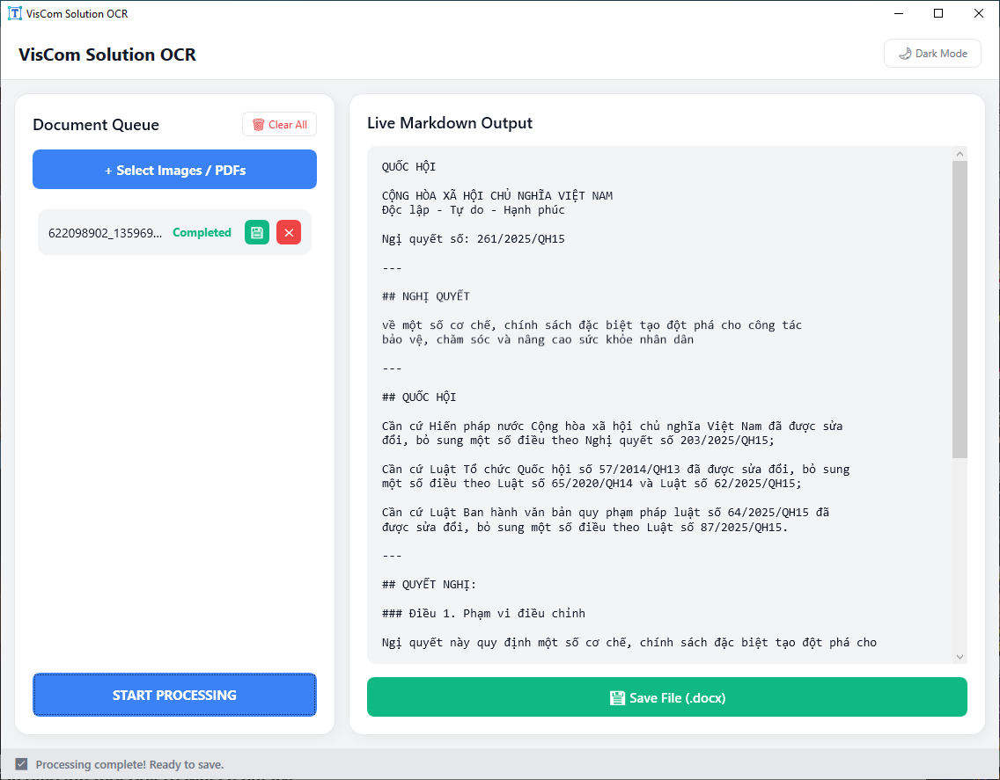

Tiếng Việt | [English](readme_en.md)

# LightOnOCR_Cpp

Ứng dụng nhận dạng chữ (OCR) thông minh, giúp bạn trích xuất nội dung từ ảnh và file PDF nhờ mô hình AI đa phương thức với 1 tỷ tham số. Kết quả được trả về dưới dạng markdown có cấu trúc, kèm vị trí từng vùng chữ, và có thể xuất ra Word (.docx), markdown hoặc văn bản thuần.



## Kiến trúc

Dự án gồm **3 phần** nằm trong 2 solution Visual Studio:

| Dự án | Ngôn ngữ | Loại | Vai trò |
|-------|----------|------|---------|
| **LightOnOCRcpp** | C++ (native) | Console EXE | Phần lõi xử lý AI, dựa trên llama.cpp |
| **LightOnOCR** | C++/CLI | DLL | Lớp kết nối giữa C++ và .NET |
| **LightOnOCR_UI** | C# WPF | Ứng dụng Desktop | Giao diện người dùng hỗ trợ kéo thả, xử lý hàng loạt, hiển thị kết quả trực tiếp |

```
LightOnOCR_UI.sln   ← Ứng dụng đầy đủ (cả 3 phần)
LightOnOCRcpp.sln   ← Chỉ dòng lệnh (CLI)
```

## Yêu cầu

- **Visual Studio 2022** (v17.14 trở lên), cài thêm workload C++ Desktop và .NET Desktop
- **.NET 8.0 SDK**
- Bộ công cụ **C++20** (v143)
- **Windows 10** trở lên, chỉ hỗ trợ x64
- **Pandoc** (dùng để chuyển markdown sang .docx)

## Mô hình AI

[Tải mô hình tại đây](https://huggingface.co/noctrex/LightOnOCR-2-1B-bbox-GGUF), sau đó đặt vào thư mục `bin/model/`:

| Tên file | Vai trò |
|----------|--------|
| `LightOnOCR-2-1B-bbox-BF16.gguf` | Mô hình ngôn ngữ chính kèm xử lý ảnh (BF16) |
| `mmproj-F32.gguf` | Bộ chiếu kết nối ảnh với mô hình ngôn ngữ |

## Hướng dẫn biên dịch

### Bước 1: Tải mã nguồn và chuẩn bị

```
copy lib/llama.cpp/lib/*.dll -> bin/
copy pandoc.exe -> bin/
```

Nhớ kiểm tra các file mô hình đã nằm trong `bin/model/`.

### Bước 2: Biên dịch ứng dụng đầy đủ (giao diện + dòng lệnh)

1. Mở `LightOnOCR_UI.sln` bằng Visual Studio 2022
2. Chọn cấu hình **Release | x64**
3. Vào **Build** → **Build Solution** (sẽ tự biên dịch cả 3 phần theo đúng thứ tự)

### Bước 3: Biên dịch riêng phiên bản dòng lệnh (không bắt buộc)

1. Mở `LightOnOCRcpp.sln` bằng Visual Studio 2022
2. Chọn cấu hình **Release-static | x64**
3. Build xong sẽ tạo ra file `LightOnOCRcpp.exe`

### Cấu trúc thư mục sau khi biên dịch

```
bin/
├── LightOnOCR_UI.exe              ← Ứng dụng giao diện (WPF)
├── LightOnOCR.dll                 ← Lớp kết nối C++/CLI
├── LightOnOCRcpp.exe              ← Công cụ dòng lệnh
├── pandoc.exe                     ← Chuyển đổi Markdown sang DOCX
├── *.dll                          ← Các thư viện của llama.cpp
├── model/
│   ├── LightOnOCR-2-1B-bbox-BF16.gguf
│   └── mmproj-F32.gguf
└── runtimes/                      ← Thư viện xử lý PDF (PDFium)
```

## Cách sử dụng

### Dùng giao diện (GUI)

```bash
bin\LightOnOCR_UI.exe
```

1. Đợi mô hình tải xong (theo dõi tiến trình ở thanh trạng thái)
2. Nhấn **"+ Select Images / PDFs"** hoặc kéo thả file vào danh sách
3. Kéo thả để sắp xếp lại thứ tự nếu muốn
4. Nhấn **"START PROCESSING"** — kết quả sẽ hiện ra ngay trong lúc xử lý
5. Lưu kết quả:
   - Một file → **Save File (.docx)**
   - Nhiều file → **Save as ZIP (.zip)** hoặc **Combine Files** (gộp lại)

**File đầu vào hỗ trợ:** PNG, JPG, JPEG, PDF (nhiều trang)
**Xuất ra:** .docx, .md, .txt, .zip

**Các tính năng nổi bật:**
- Hiển thị kết quả ngay trong lúc xử lý (streaming)
- Tự động phát hiện vùng chữ và cắt ảnh theo vùng
- Xử lý PDF nhiều trang với độ phân giải 300 DPI
- Chuyển đổi giao diện Sáng / Tối
- Xuất hàng loạt ra file ZIP

### Dùng dòng lệnh (CLI)

```bash
LightOnOCRcpp.exe <đường_dẫn_mô_hình> <đường_dẫn_mmproj> <đường_dẫn_ảnh> [prompt]
```

**Ví dụ:**

```bash
LightOnOCRcpp.exe model\LightOnOCR-2-1B-bbox-BF16.gguf model\mmproj-F32.gguf document.png
```

Kết quả sẽ được in ra màn hình kèm tọa độ vùng chữ.

## Các thư viện sử dụng

| Thư viện | Công dụng |
|----------|----------|
| [llama.cpp](https://github.com/ggml-org/llama.cpp) | Chạy mô hình ngôn ngữ lớn (GGML/GGUF) |
| [PDFtoImage](https://www.nuget.org/packages/PDFtoImage) | Chuyển PDF thành ảnh |
| [SkiaSharp](https://www.nuget.org/packages/SkiaSharp) | Cắt và xử lý ảnh |
| [PDFium](https://www.nuget.org/packages/bblanchon.PDFium.Win32) | Hiển thị nội dung PDF |
| [Pandoc](https://pandoc.org/) | Chuyển Markdown sang DOCX |
